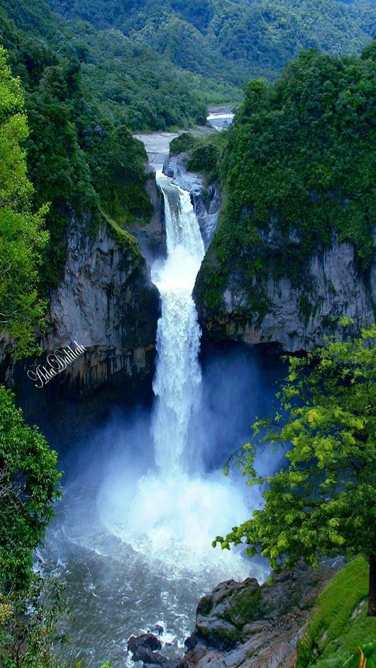
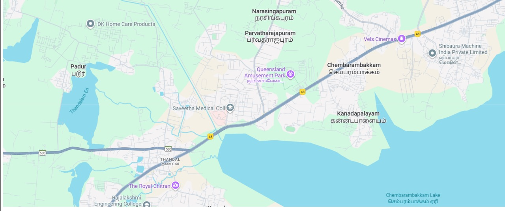
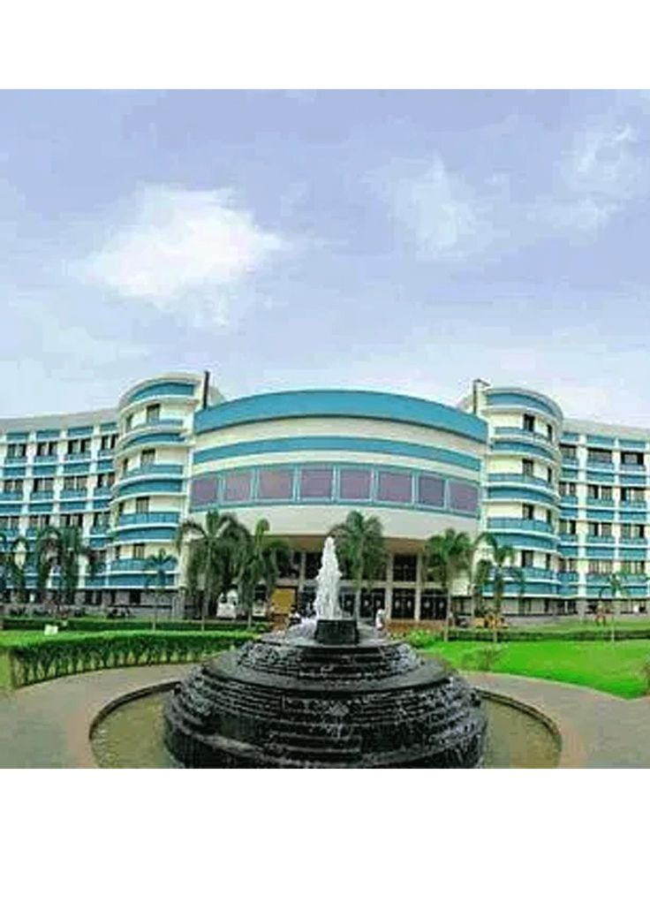

# Ex04 Places Around Me
## Date:13/10/2025 

## AIM
To develop a website to display details about the places around my house.

## DESIGN STEPS

### STEP 1
Create a Django admin interface.

### STEP 2
Download your city map from Google.

### STEP 3
Using ```<map>``` tag name the map.

### STEP 4
Create clickable regions in the image using ```<area>``` tag.

### STEP 5
Write HTML programs for all the regions identified.

### STEP 6
Execute the programs and publish them.

## CODE
```
map.html
<!-- Image Map Generated by http://www.image-map.net/ -->


<map name="image-map">
    <area target="" alt="Saveetha" title="Saveetha" href="Saveetha.html" coords="620,241,410,357" shape="rect">
    <area target="" alt="Queens" title="Queens" href="Queens.html" coords="593,222,794,124" shape="rect">
    <area target="" alt="Padur" title="Padur" href="Padur.html" coords="192,175,64" shape="circle">
</map>

padur.html
<html lang="en">
<head>
    <meta charset="UTF-8">
    <meta name="viewport" content="width=device-width, initial-scale=1.0">
    <title>Document</title>
</head>
<body>
    <h1>PADUR</h1>
    
    <p>Padur* is a fast-growing suburban area located along the Old Mahabalipuram Road (OMR) in Chennai, Tamil Nadu.
        It lies close to major IT hubs like *Siruseri SIPCOT, making it a preferred residential location for IT professionals.
        The area offers excellent road connectivity through OMR and the Kelambakkam–Vandalur Road, and the upcoming Chennai Metro Phase II is expected to further improve access. 
        Padur has seen rapid real estate growth in recent years, with several *modern apartments, gated communities, and luxury housing projects emerging.
         Property prices are relatively affordable compared to central Chennai, attracting both investors and first-time buyers.</p>
</body>
</html>

queens.html
<html lang="en">
<head>
    <meta charset="UTF-8">
    <meta name="viewport" content="width=device-width, initial-scale=1.0">
    <title>Document</title>
</head>
<body>
    <h1>QUEENS </h1>
    
    <p>Queens Land, established in 2003 and located along the Chennai-Bengaluru Trunk Road in Palanjur, Sembarambakkam, spans about 70 acres and is one of the most popular amusement and water parks in Chennai.
 It offers over 50 rides—33 for adults and 18 for children—including thrill rides like the Free Fall Tower, Alpen Blitz, roller coasters and water slides.The park includes both dry rides and a water-park section, with features such as wave pools, long slides, and swim pools for men and women. 
Chennai Tourism. One unique attraction is its 1.5 km cable car that gives visitors an aerial view of the park. 
 It’s a popular destination for families, teenagers, and groups, offering both exhilarating rides and gentler options for younger kids.  The lush greenery and landscaped surroundings add to its appeal, making it not just a rides destination but also a pleasant outing spot.  Queens Land is open generally 10:00 AM to around 6:30 PM on weekdays, and longer hours during weekends.  Entry fees are modest, with different rates for adults and children; height-based criteria apply for some rides.  Facilities include food stalls, swimming pools, boating, bumper cars, go-karts, and places to relax after rides.
   Overall, Queens Land is one of the best day-trip amusement parks near Chennai.</p>
</body>
</html>

saveetha.html
<html lang="en">
<head>
    <meta charset="UTF-8">
    <meta name="viewport" content="width=device-width, initial-scale=1.0">
    <title>Document</title>
</head>
<body>
    <h1>SAVEETHA</h1>
    
    <p>
        Saveetha Engineering College (SEC), established in *2001 under the Saveetha Medical and Educational Trust, is one of the leading autonomous institutions affiliated with *Anna University, Chennai. 
        The college has earned an *‘A’ grade accreditation from NAAC and several of its programs are accredited by the *National Board of Accreditation (NBA).
        Recognized as a *Scientific and Industrial Research Organisation (SIRO) by the Government of India, SEC is known for its strong focus on research and innovation. 
        It offers a wide range of undergraduate and postgraduate programs in core and modern engineering fields such as Artificial Intelligence, Data Science, Cybersecurity, and IoT.
    </p>
</body>
</html>

```
## OUTPUT




## RESULT
The program for implementing image maps using HTML is executed successfully.
